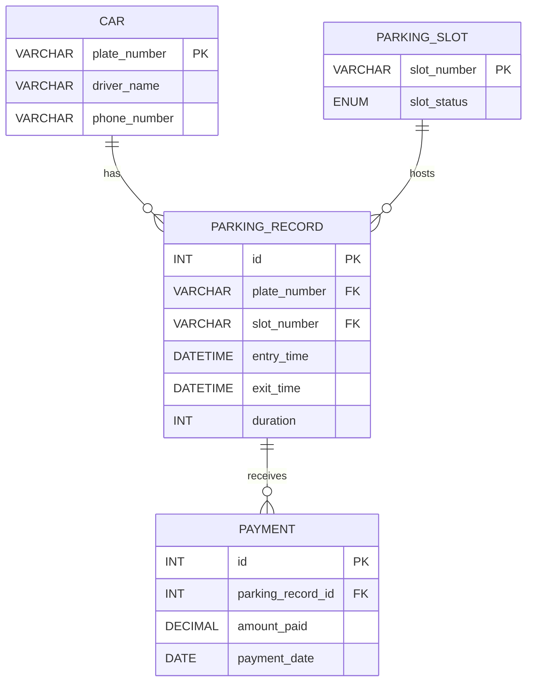

# Parking Sales Management System (PSSMS)

A full-stack parking management system with:
- Car management
- Parking slot management
- Parking record CRUD operations
- Payment recording
- Report viewing

## Entity Relationship Diagram (ERD)

## Database design

- Database name: `PSSMS`
- Tables:
  - `car(plate_number PK, driver_name, phone_number)`
  - `parking_slot(slot_number PK, slot_status)`
  - `parking_record(id PK, plate_number FK, slot_number FK, entry_time, exit_time, duration)`
  - `payment(id PK, parking_record_id FK, amount_paid, payment_date)`

## Project structure

- `backend-project/` - Node.js + Express backend connecting to MySQL
- `frontend-project/` - React + Tailwind CSS frontend

## Setup

1. Create the database and tables using `backend-project/schema.sql`.
2. Configure backend environment by copying `backend-project/.env.example` to `.env`.
3. Configure frontend environment by copying `frontend-project/.env.example` to `.env`.
4. Install dependencies in each folder:
   - `cd backend-project && npm install`
   - `cd frontend-project && npm install`
5. Start backend and frontend:
   - `npm run dev` in `backend-project`
   - `npm run dev` in `frontend-project`

## Notes

- `car`, `parkingslot`, and `payment` forms support `INSERT` only.
- `parkingrecord` form supports `INSERT`, `RETRIEVE`, `UPDATE`, and `DELETE`.
- The UI includes pages: `Car`, `Parking Slot`, `Parking Record`, `Payment`, `Report`, and `Logout`.

